# Bài 1

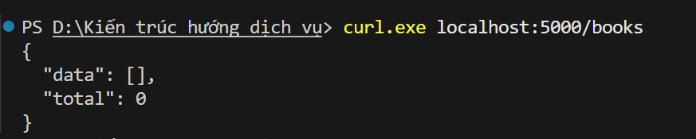
**GET ban đầu**

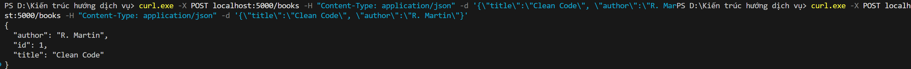
**POST ban đầu**

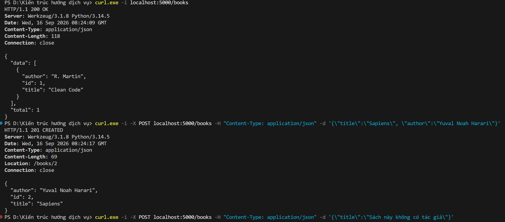
**GET 200, POST 201**

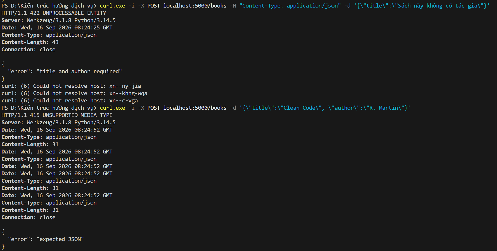
**POST 422, 415**

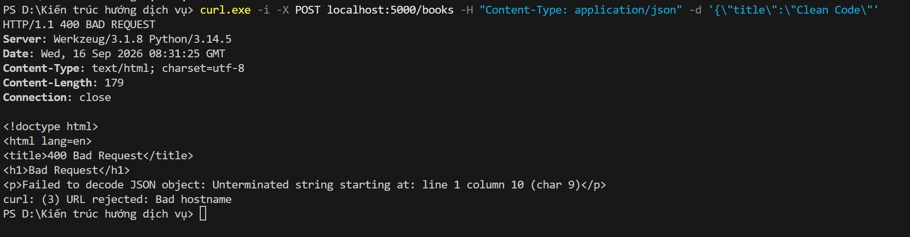
**POST 400**

# Bài 2

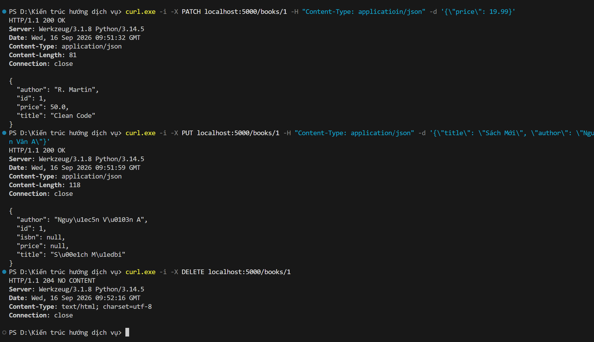
**PATCH 200, PUT 200, DELETE 204**

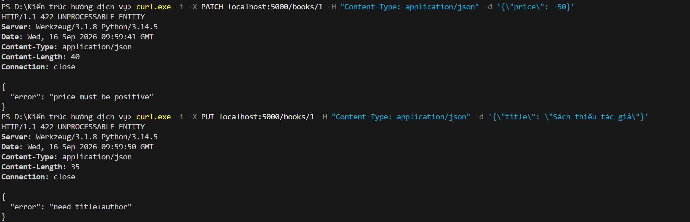
**PATCH 422 - PRICE<0, PUT 422 - Title/Author thiếu**

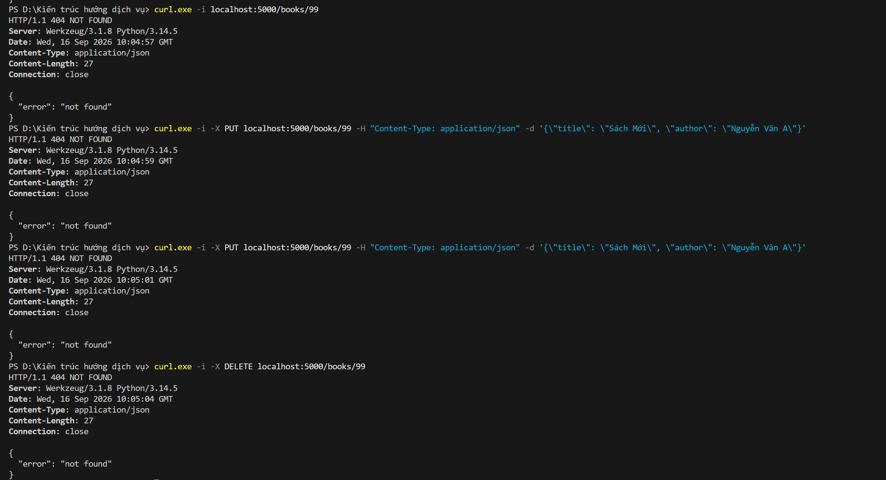
**GET 404, PATCH 404, PUT 404, DELETE 404**

# Bài 3

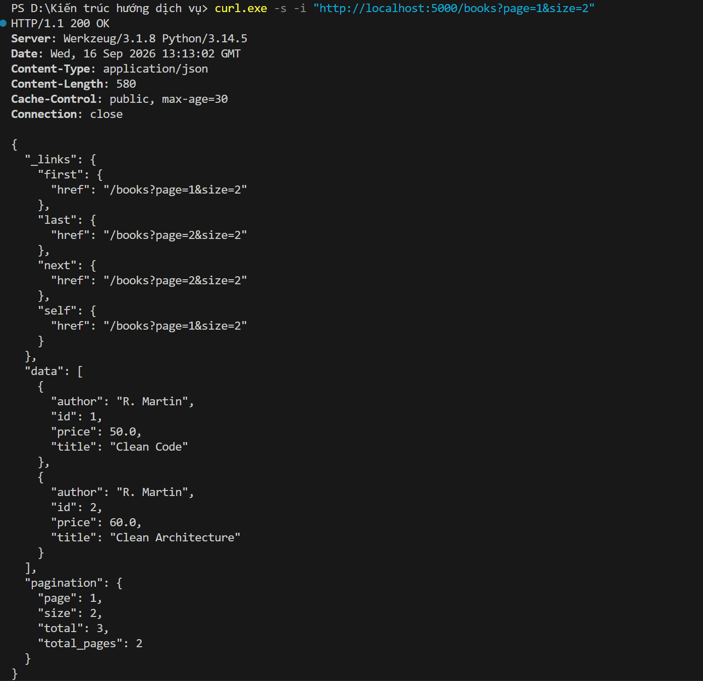
**200 HATEOAS**

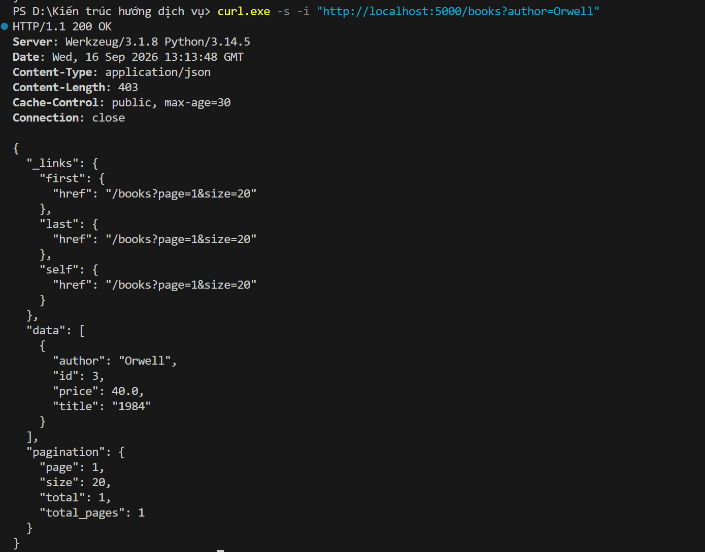
**200 Author**

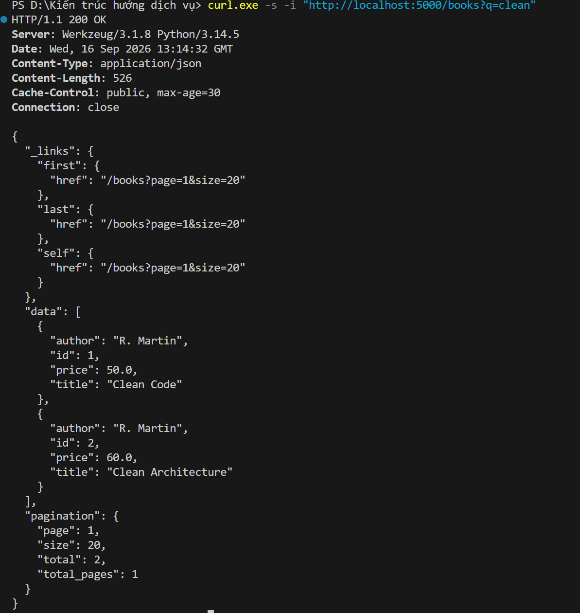
**200 q=clean**

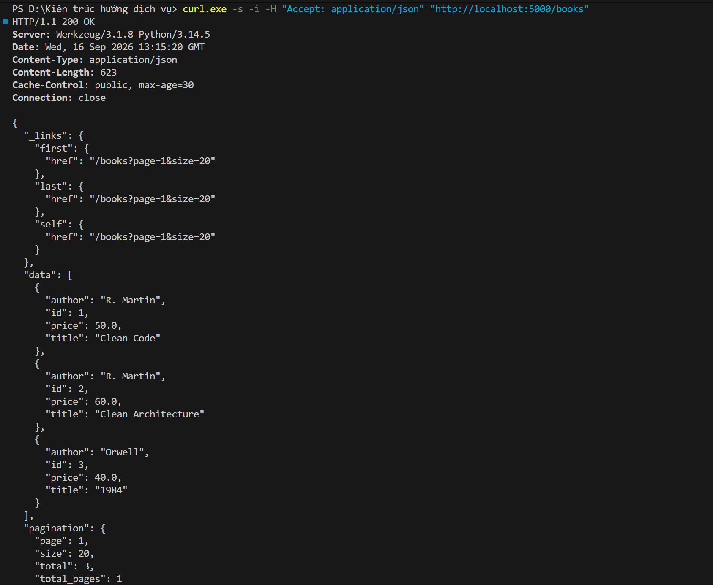
**200 Header accept JSON**

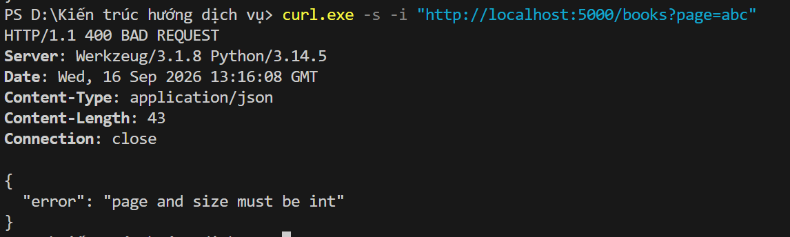
**400 page=abc**